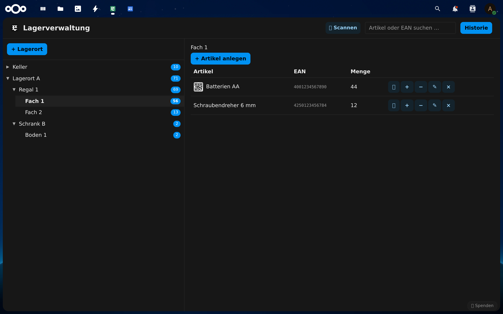
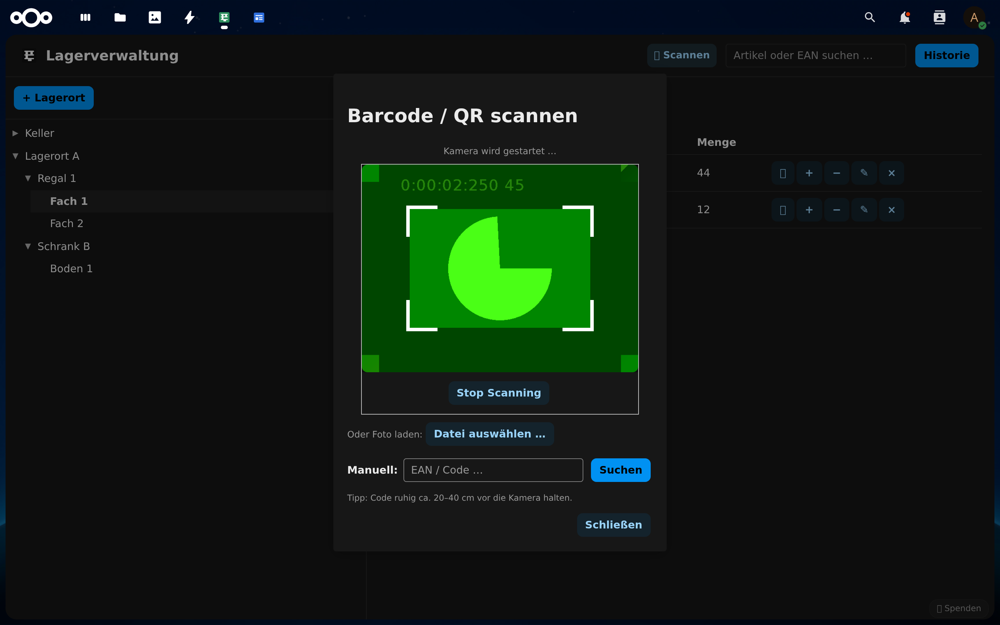
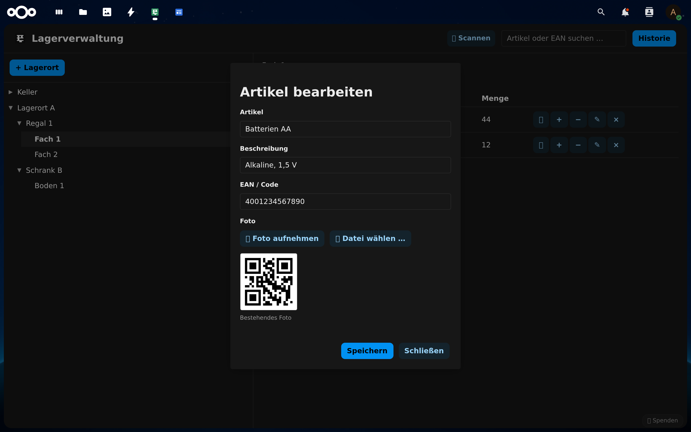
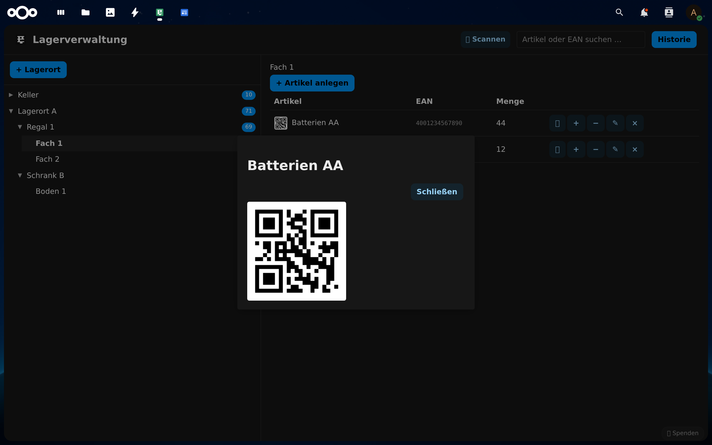
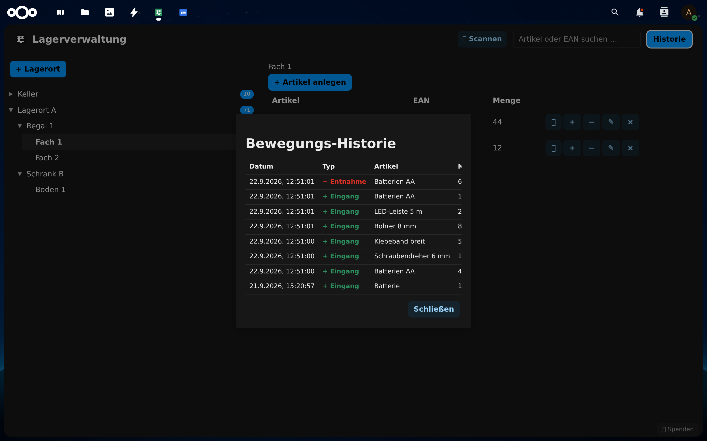
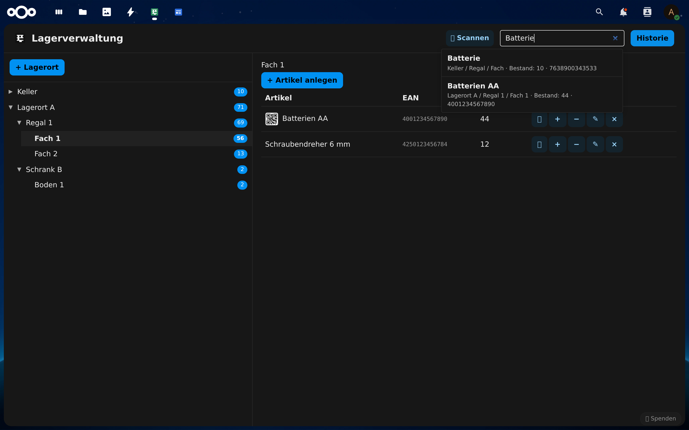

# Lagerverwaltung für Nextcloud

Eine schlanke Lagerhaltungs-App für Nextcloud: Verwalte deine Lagerorte, Regale und Fächer, buche Wareneingänge und -entnahmen und finde Artikel per Suche oder **Barcode/QR-Scan mit der Kamera**.

## Funktionen

- **Lagerstruktur:** Lagerorte → Regale/Schränke → Fächer/Flächen (beliebig viele)
- **Artikel:** Name, Beschreibung, EAN/Code, optional ein Foto (per Kamera oder Datei)
- **Lagerbewegungen:** Wareneingang und Entnahme buchen, mit Notiz und Benutzer
- **Historie:** vollständige Bewegungs-Historie mit Datum, Typ, Menge und Benutzer
- **Suche:** artikel- und EAN-Suche (Groß-/Kleinschreibung egal)
- **Cam-Scanning:** Barcode (EAN-13, EAN-8) und QR-Codes live mit der Kamera scannen – mit Rückkamera-Voreinstellung und Kamerawahl bei mehreren Kameras
- **Foto-Scan:** Barcodes/QR-Codes auch aus einer Foto-Datei erkennen (robust, mit Entzerrung)
- **QR/Barcode erzeugen:** zu jedem Artikel per Knopfdruck als QR-Code oder EAN-Barcode
- **Mehrsprachig:** Deutsch und Englisch (weitere Sprachen willkommen)

## Screenshots

| Scan mit Kamera | Artikel bearbeiten (mit Foto) | Große Foto-Ansicht |
|---|---|---|
|  |  |  |

| Bewegungs-Historie | Suche |
|---|---|
|  |  |

## Installation

1. App im [Nextcloud App-Store](https://apps.nextcloud.com/apps/lager) suchen und installieren, **oder**
2. den Ordner in `apps/` (oder `apps-extra/`) kopieren und im Admin-Bereich aktivieren.

Voraussetzung: Nextcloud 26–34, PHP 8.1–8.4. Für das Cam-Scanning wird ein moderner Browser mit Kamera-Zugriff empfohlen (Chrome/Edge, Firefox).

## Datenschutz

Alle Daten (Struktur, Artikel, Bewegungen, Fotos) bleiben in deiner eigenen Nextcloud-Instanz. Es werden keine Daten an externe Server gesendet. Fotos werden komprimiert (max. 1024 px) lokal gespeichert.

## Lizenz

[AGPL-3.0](https://www.gnu.org/licenses/agpl-3.0.de.html)

## Spende

Gefällt dir die App? Du kannst mich gerne mit einer kleinen Spende unterstützen:
[PayPal: paypal.me/ToniWenig](https://paypal.me/ToniWenig)
